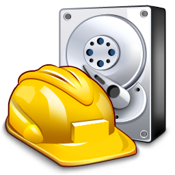

# Recuperacion de Datos
## Aplicacion
Recuva
## Descripción
Recuva es una herramienta gratuita que de una forma muy sencilla y dinamica escanea la unidad que usted seleccione e 
identifica los documentos, imagenes y videos borrados. Es capaz de recurperarlos y devolverlos a su forma original.
## Link de descarga
- [Pincha aquí :)](https://www.ccleaner.com/knowledge/recuva-v1-53-2078?cc-noredirect=)

## Video
- [Pulse aqui :)](https://www.youtube.com/watch?v=F7zcKOaUhsU)

