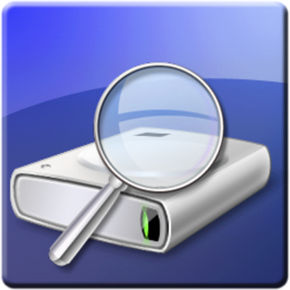

# Testeo discos
## Aplicacion
Crystal Disk Info
## Descripción
El programa permite controlar el funcionamiento del disco o discos instalados en el ordenador, vigilando su estado de salud al incluir la temperatura que alcanza en cada momento. Permite hacer un estudio de forma sencilla de los discos del sistema.
## Link de descarga
- [Pinche aquí :)](https://crystalmark.info/en/software/crystaldiskinfo/)

## Video
- [Pulse aqui :)](https://youtu.be/dmd5RXw4f5U)

